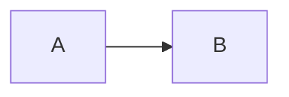
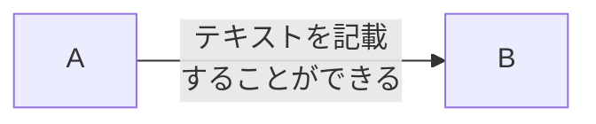
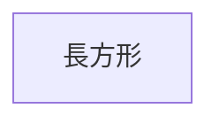
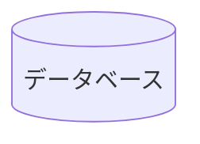
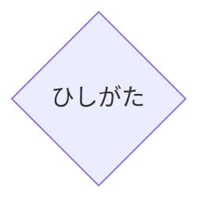
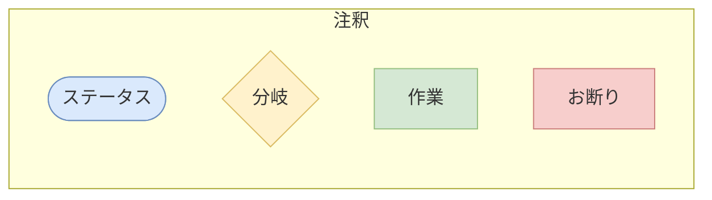
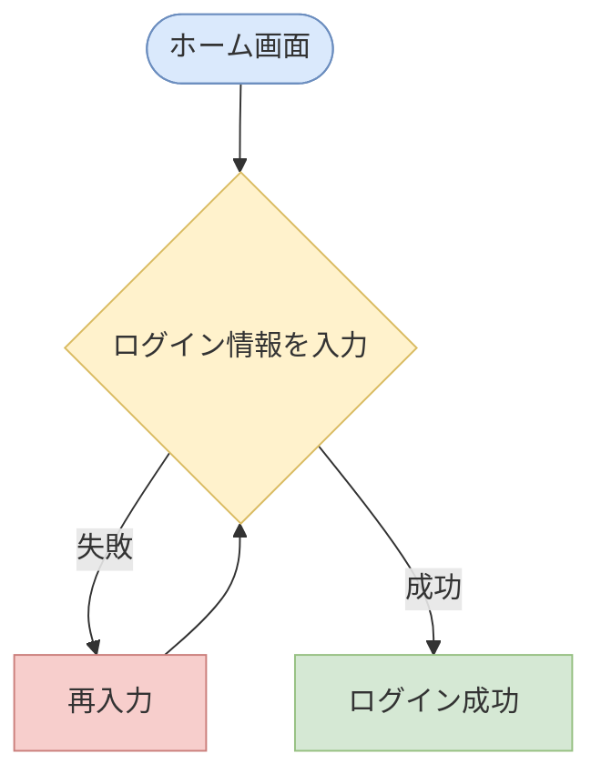

## 概要
Mermaidは公式ドキュメントに記載されているようにマークダウンで図を簡単に作成できるツールです
> It is a JavaScript based diagramming and charting tool that renders Markdown-inspired text definitions to create and modify diagrams dynamically.

- README
- Qiita
- esa

などマークダウンを使う書く機会が豊富にあるので
- いつでも確認できるチートシート
- よく使う図のスニペット 

を作成したくて執筆しています

## 作成方法について説明する図の一覧
Mermaidで作成できるものはたくさんありますが全て書くとキリがないので業務でよく使う
フロー図を書く際によく使うマークダウンに絞って記事を執筆していきます

## フロー図の作成
フロー図を作成する際に以下のように
`flowchart`とその横に`TB`というふうにフロー図の矢印の向きを記載します

```
flowchart TB
    A-->B
```


## 矢印
矢印の向きの一覧は以下の通りです

|単語|説明|
|---|---|
|TB(Top to Bottom)|上から下|
|BT(Bottom to Top)|下から上|
|RL(Right to Left)|右から左|
|LR(Left to Right)|左から右|

### 通常の矢印
ノード間に`-->`と記載すると矢印を書くことができます
```
flowchart LR
    A-->B
```


### 矢印内にテキストを入れる
`>`とノードの間に`||`を記載し、`||`の間にテキストを入れると表示されます
また、`<br>`を入れると改行もできます
```
flowchart LR
    A-->|テキストを記載<br>することができる|B
```


## ノード
### 長方形
`[]`を使用します
```
flowchart LR
    id1["長方形"]
```

### 楕円形
`([])`を使用します
```
flowchart LR
    id1(["楕円形"])
```


### データベース
`[()]`を使用します
```
flowchart LR
    id1[(データベース)]
```


### ひしがた
`{}`を使用します
```
flowchart LR
    A{"ひしがた"}
```


## テンプレート例
### 注釈
```
flowchart LR
classDef blue fill:#DAE9FC,stroke:#6C8EBF
classDef yellow fill:#FFF2CC,stroke:#DABC63
classDef green fill:#D5E8D4,stroke:#96C082
classDef red fill:#F7CECC,stroke:#CB7F7C

    subgraph "注釈"
        status(["ステータス"]):::blue
        branch{"分岐"}:::yellow
        task["作業"]:::green
        refusal["お断り"]:::red
    end
```


### フロー図の例
```
flowchart TB
classDef blue fill:#DAE9FC,stroke:#6C8EBF
classDef yellow fill:#FFF2CC,stroke:#DABC63
classDef green fill:#D5E8D4,stroke:#96C082
classDef red fill:#F7CECC,stroke:#CB7F7C

home(["ホーム画面"]):::blue-->enterLoginInfo["ログイン情報を入力"]:::yellow
enterLoginInfo{"ログイン情報を入力"}:::yellow-->|"失敗"|enterLoginInfoAgain["再入力"]:::red
enterLoginInfo{"ログイン情報を入力"}:::yellow-->|"成功"|loginSuccess["ログイン成功"]:::green
enterLoginInfoAgain["再入力"]:::red-->enterLoginInfo{"ログイン情報を入力"}:::yellow
```


## まとめ
今後使っていく可能性がありそうな記法があれば随時追加していきたいと思います

## 参考
https://notepm.jp/help/mermaid

https://zenn.dev/microsoft/articles/learning-mermaid

https://mermaid.js.org/syntax/flowchart.html

https://zenn.dev/junkawa/articles/zenn-mermaidjs-theme-config

https://note.com/yukkakiyo/n/n4e6766b795b0
